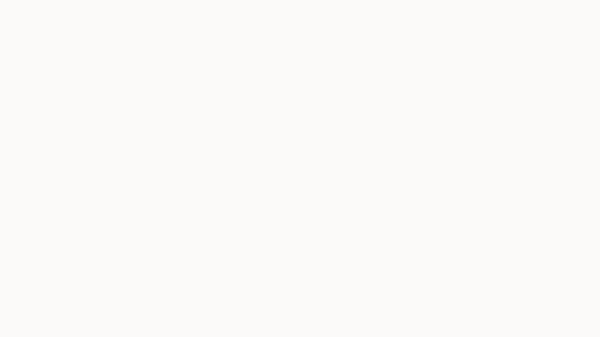
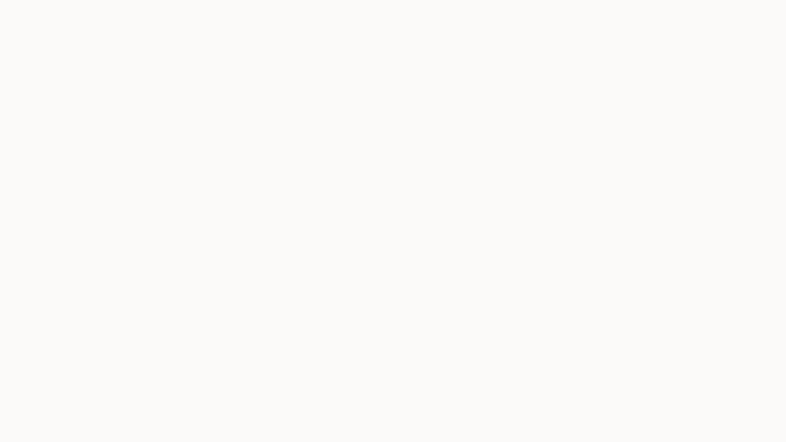
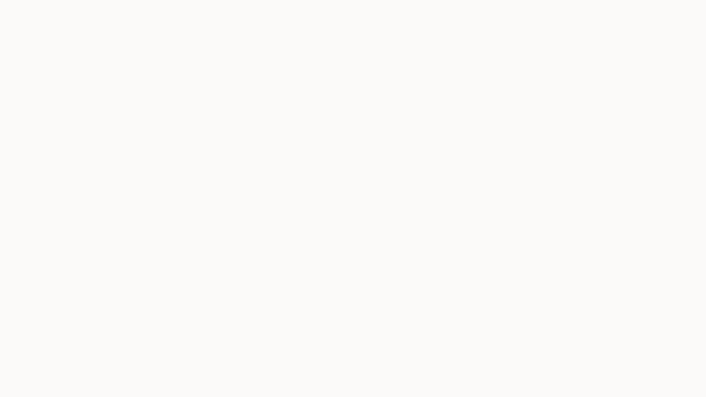

# RouteFlow

> 智能路径规划可视化与 AI 助手平台
>
> Intelligent Path Planning Visualization & AI Assistant Platform

**Version 2.3.0** | [MIT License](LICENSE) | [中文](#中文) | [English](#english)

---

## 中文

RouteFlow 是一个集成的路径规划演示平台，包含基于网格的规划算法、动态障碍物仿真、2D/3D 可视化、AI 辅助代码生成和完整的 API 后端。

### 📸 界面预览

<table>
  <tr>
    <td align="center"><b>深色主题 (中文)</b></td>
    <td align="center"><b>浅色主题 (中文)</b></td>
  </tr>
  <tr>
    <td></td>
    <td></td>
  </tr>
  <tr>
    <td align="center"><b>路径规划可视化</b></td>
    <td align="center"><b>英文界面</b></td>
  </tr>
  <tr>
    <td></td>
    <td></td>
  </tr>
</table>

### ✨ 功能亮点

- **交互式 Web UI** - 地图生成、起点/终点编辑、规划执行、运行历史
- **4 种路径规划算法** - A\*, D\* Lite, RRT\*, ACO，支持参数调节
- **2D/3D 可视化** - 算法实时可视化，带动画效果和性能指标
- **AI 助手** - 兼容 OpenAI/DeepSeek 的对话 API，支持算法解释和代码生成
- **后端持久化** - 本地工作区，保存地图草稿和对比记录
- **生产级后端** - FastAPI，含安全防护、限流、缓存和完整测试
- **算法基准测试** - 多算法批量对比，生成统计报告
- **数据统计** - 运行历史记录、算法排名、趋势分析
- **快捷键系统** - 18+ 快捷键，提升操作效率
- **国际化** - 中英文双语支持

### 🛠️ 技术栈

| 层级 | 技术 |
|------|------|
| 前端 | React 18, Vite 5, Three.js, OGL |
| 后端 | FastAPI, Uvicorn, Pydantic v2 |
| 样式 | 模块化 CSS (主题/布局/组件/工具类) |
| 国际化 | i18next (zh/en) |
| 测试 | Vitest (前端), pytest (后端) |
| 运维 | Docker, Makefile, Git hooks |

### 📁 项目结构

```
IntegratedPathPlanning/
├── api/                    # FastAPI 后端
│   ├── app.py              # 主应用
│   ├── models.py           # Pydantic 数据模型
│   ├── rate_limiter.py     # 限流配置
│   ├── cache.py            # 响应缓存
│   ├── performance.py      # 性能监控
│   ├── security_middleware.py  # 安全中间件
│   ├── test_app.py         # 后端测试 (42 个)
│   └── .env.example        # 环境变量模板
├── web/                    # Vite React 前端
│   ├── src/
│   │   ├── app/            # React 应用
│   │   │   ├── components/ # UI 组件
│   │   │   ├── hooks/      # 自定义 Hooks
│   │   │   ├── services/   # 业务服务
│   │   │   ├── styles/     # 样式模块
│   │   │   ├── data/       # 静态数据
│   │   │   └── utils/      # 工具函数
│   │   ├── locales/        # 翻译文件 (zh/en)
│   │   └── __tests__/      # 前端测试
│   ├── index.html
│   └── vite.config.js
├── src/                    # Python 算法实现
│   └── algorithms/         # 路径规划算法
├── docs/                   # 文档
├── scripts/                # 开发脚本
├── Makefile                # 开发命令
├── docker-compose.yml      # 生产 Docker 配置
├── Dockerfile.api          # 后端容器
├── Dockerfile.web          # 前端容器 (nginx)
└── requirements.txt        # Python 依赖
```

### 🚀 快速开始

#### Windows 一键启动

```bash
start-routeflow.bat
```

这将启动 FastAPI 后端 (`http://127.0.0.1:8000`) 和 Vite 前端 (`http://127.0.0.1:5173`)。

```bash
stop-routeflow.bat    # 停止服务器
```

#### 手动安装

**前端：**

```bash
cd web
npm install
npm run dev
```

**后端：**

```bash
python -m venv .venv
.venv\Scripts\activate
pip install -r requirements.txt
python -m uvicorn api.app:app --reload --host 127.0.0.1 --port 8000
```

**健康检查：**

```bash
curl http://127.0.0.1:8000/api/health
```

### 📋 开发命令

```bash
make help          # 显示所有可用命令
make install       # 安装所有依赖
make dev           # 启动前端开发服务器
make test          # 运行所有测试
make test:backend  # 运行后端测试
make lint          # 运行 ESLint
make format        # 使用 Prettier 格式化代码
make build         # 生产构建
make docker        # 构建 Docker 镜像
make clean         # 清理构建产物
```

### 🔧 环境变量

#### 后端 (api/.env)

```bash
# 服务器
HOST=127.0.0.1
PORT=8000
ENVIRONMENT=development

# 安全
ENABLE_GIT_API=false
CORS_ORIGINS=http://localhost:5173,http://localhost:5174,http://localhost:5175
ALLOW_PERSIST_API_KEYS=false

# 限流
RATE_LIMIT_DEFAULT=100/minute
RATE_LIMIT_CHAT=20/minute
RATE_LIMIT_CODE_GEN=10/minute

# 缓存
CACHE_TTL_SECONDS=300
CACHE_MAX_SIZE=512

# 日志
LOG_LEVEL=INFO
JSON_LOGS=false
```

#### 前端 (.env)

```bash
VITE_API_BASE_URL=http://127.0.0.1:8000
VITE_APP_TITLE=RouteFlow
```

### 🔌 后端 API

| 端点 | 方法 | 描述 |
|------|------|------|
| `/api/health` | GET | 健康检查 |
| `/api/algorithms` | GET | 算法列表 |
| `/api/compare-algorithms` | GET | 算法对比数据 |
| `/api/chat` | POST | AI 对话 (限流) |
| `/api/generate-code` | POST | 生成算法代码 |
| `/api/optimize-code` | POST | 优化代码 |
| `/api/workspace` | GET/POST | 工作区持久化 |
| `/api/save-config` | POST | 保存 API 配置 |
| `/api/get-config` | GET | 获取 API 配置 |
| `/api/cache/stats` | GET | 缓存统计 |
| `/api/performance/stats` | GET | 性能指标 |

### 🔒 安全特性

- **内容安全策略 (CSP)** - XSS 和注入防护
- **API 限流** - 按端点限制请求频率
- **SSRF 防护** - 阻止 URL 中的内网地址
- **输入验证** - Pydantic v2 严格模式验证
- **API Key 管理** - 默认不持久化密钥
- **Git 路径遍历防护** - 沙盒化目录访问
- **安全响应头** - X-Frame-Options, X-Content-Type-Options 等
- **请求 ID 追踪** - 端到端请求追踪

### 🧪 测试

```bash
# 前端测试
npm run test

# 后端测试
cd api && python -m pytest -v

# 运行所有测试
make test
```

### 🐳 Docker 部署

```bash
# 构建镜像
docker-compose build

# 启动生产环境
docker-compose up -d

# 开发模式
docker-compose -f docker-compose.dev.yml up --build

# 停止
docker-compose down
```

### 📄 许可证

MIT License。详见 [LICENSE](LICENSE)。

### 📝 更新日志

详见 [CHANGELOG.md](CHANGELOG.md)。

---

## English

RouteFlow is an integrated path planning demo platform featuring grid-based planning algorithms, dynamic obstacle simulation, 2D/3D visualization, AI-assisted code generation, and comprehensive API backend.

### 📸 Screenshots

<table>
  <tr>
    <td align="center"><b>Dark Theme (Chinese)</b></td>
    <td align="center"><b>Light Theme (Chinese)</b></td>
  </tr>
  <tr>
    <td></td>
    <td></td>
  </tr>
  <tr>
    <td align="center"><b>Path Visualization</b></td>
    <td align="center"><b>English Interface</b></td>
  </tr>
  <tr>
    <td></td>
    <td></td>
  </tr>
</table>

### ✨ Highlights

- **Interactive Web UI** - Map generation, start/goal editing, planning execution, and run history
- **4 Path Planning Algorithms** - A\*, D\* Lite, RRT\*, ACO with tunable parameters
- **2D/3D Visualization** - Real-time algorithm visualization with motion effects and metrics
- **AI Assistant** - OpenAI/DeepSeek-compatible chat API for algorithm explanation and code generation
- **Backend Persistence** - Local workspace for map drafts and comparison records
- **Production-Ready Backend** - FastAPI with security, rate limiting, caching, and comprehensive testing
- **Algorithm Benchmarking** - Multi-algorithm batch comparison with statistical reports
- **Data Statistics** - Run history, algorithm rankings, trend analysis
- **Keyboard Shortcuts** - 18+ shortcuts for improved efficiency
- **Internationalization** - Bilingual support (zh/en)

### 🛠️ Tech Stack

| Layer | Technology |
|-------|------------|
| Frontend | React 18, Vite 5, Three.js, OGL |
| Backend | FastAPI, Uvicorn, Pydantic v2 |
| Styling | Modular CSS (theme/layout/components/utilities) |
| i18n | i18next (zh/en) |
| Testing | Vitest (frontend), pytest (backend) |
| DevOps | Docker, Makefile, Git hooks |

### 📁 Project Layout

```
IntegratedPathPlanning/
├── api/                    # FastAPI backend
│   ├── app.py              # Main application
│   ├── models.py           # Pydantic schemas
│   ├── rate_limiter.py     # Rate limiting config
│   ├── cache.py            # Response caching
│   ├── performance.py      # Performance monitoring
│   ├── security_middleware.py  # Security middleware
│   ├── test_app.py         # Backend tests (42 tests)
│   └── .env.example        # Environment template
├── web/                    # Vite React frontend
│   ├── src/
│   │   ├── app/            # React application
│   │   │   ├── components/ # UI components
│   │   │   ├── hooks/      # Custom Hooks
│   │   │   ├── services/   # Business services
│   │   │   ├── styles/     # Style modules
│   │   │   ├── data/       # Static data
│   │   │   └── utils/      # Utility functions
│   │   ├── locales/        # Translation files (zh/en)
│   │   └── __tests__/      # Frontend tests
│   ├── index.html
│   └── vite.config.js
├── src/                    # Python algorithm implementations
│   └── algorithms/         # Path planning algorithms
├── docs/                   # Documentation
├── scripts/                # Dev scripts
├── Makefile                # Development commands
├── docker-compose.yml      # Production Docker setup
├── Dockerfile.api          # Backend container
├── Dockerfile.web          # Frontend container (nginx)
└── requirements.txt        # Python dependencies
```

### 🚀 Quick Start

#### One-Click Start (Windows)

```bash
start-routeflow.bat
```

This starts the FastAPI backend (`http://127.0.0.1:8000`) and Vite frontend (`http://127.0.0.1:5173`).

```bash
stop-routeflow.bat    # Stop servers
```

#### Manual Setup

**Frontend:**

```bash
cd web
npm install
npm run dev
```

**Backend:**

```bash
python -m venv .venv
.venv\Scripts\activate
pip install -r requirements.txt
python -m uvicorn api.app:app --reload --host 127.0.0.1 --port 8000
```

**Health Check:**

```bash
curl http://127.0.0.1:8000/api/health
```

### 📋 Development Commands

```bash
make help          # Show all available commands
make install       # Install all dependencies
make dev           # Start frontend dev server
make test          # Run all tests
make test:backend  # Run backend tests
make lint          # Run ESLint
make format        # Format code with Prettier
make build         # Build for production
make docker        # Build Docker images
make clean         # Clean build artifacts
```

### 🔧 Environment Variables

#### Backend (api/.env)

```bash
# Server
HOST=127.0.0.1
PORT=8000
ENVIRONMENT=development

# Security
ENABLE_GIT_API=false
CORS_ORIGINS=http://localhost:5173,http://localhost:5174,http://localhost:5175
ALLOW_PERSIST_API_KEYS=false

# Rate Limiting
RATE_LIMIT_DEFAULT=100/minute
RATE_LIMIT_CHAT=20/minute
RATE_LIMIT_CODE_GEN=10/minute

# Caching
CACHE_TTL_SECONDS=300
CACHE_MAX_SIZE=512

# Logging
LOG_LEVEL=INFO
JSON_LOGS=false
```

#### Frontend (.env)

```bash
VITE_API_BASE_URL=http://127.0.0.1:8000
VITE_APP_TITLE=RouteFlow
```

### 🔌 Backend API

| Endpoint | Method | Description |
|----------|--------|-------------|
| `/api/health` | GET | Health check |
| `/api/algorithms` | GET | List planning algorithms |
| `/api/compare-algorithms` | GET | Algorithm comparison data |
| `/api/chat` | POST | AI chat (rate limited) |
| `/api/generate-code` | POST | Generate algorithm code |
| `/api/optimize-code` | POST | Optimize code |
| `/api/workspace` | GET/POST | Workspace persistence |
| `/api/save-config` | POST | Save API configuration |
| `/api/get-config` | GET | Get API configuration |
| `/api/cache/stats` | GET | Cache statistics |
| `/api/performance/stats` | GET | Performance metrics |

### 🔒 Security Features

- **Content Security Policy** (CSP) - XSS and injection protection
- **Rate Limiting** - Per-endpoint request limits
- **SSRF Protection** - Blocks internal network addresses in URLs
- **Input Validation** - Pydantic v2 strict schema validation
- **API Key Management** - Keys never persisted by default
- **Git Path Traversal Protection** - Sandboxed directory access
- **Security Headers** - X-Frame-Options, X-Content-Type-Options, etc.
- **Request ID Tracking** - End-to-end request tracing

### 🧪 Testing

```bash
# Frontend tests
npm run test

# Backend tests
cd api && python -m pytest -v

# Run all tests
make test
```

### 🐳 Docker Deployment

```bash
# Build images
docker-compose build

# Start production
docker-compose up -d

# Development mode
docker-compose -f docker-compose.dev.yml up --build

# Stop
docker-compose down
```

### 📄 License

MIT. See [LICENSE](LICENSE).

### 📝 Changelog

See [CHANGELOG.md](CHANGELOG.md) for version history.
